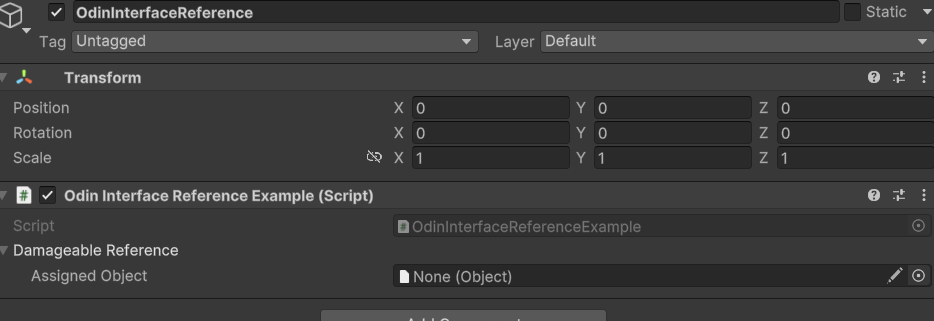
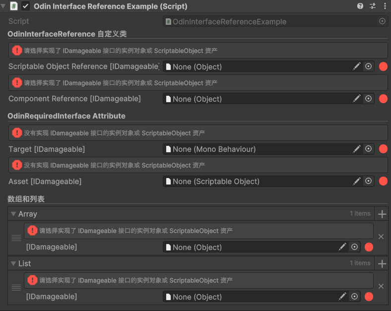
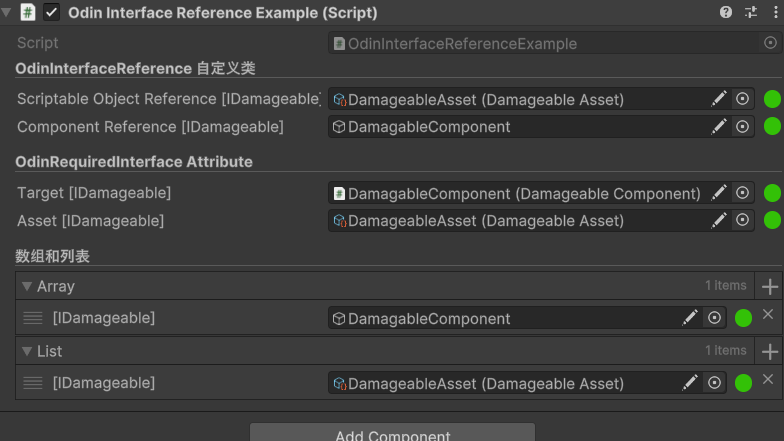

# InterfaceReference

## 设计步骤

1. 编写设计一个自定义类型，用于存储继承了<u>**特定接口**</u>的对象引用
2. 重新设计 InterfaceReference 的抽屉绘制，使其能够拖拽对象选择
3. 设计 `[OdinRequiredInterface()]` 属性，表示特殊类型才可以分配给该字段

## 准备

- Unity 6 LTS
- Odin 3.3.1.10

## 设计

### 自定义类设计 OdinInterfaceReference<TInterface，TObject>

1. 需要实现对象或者资产拖拽操作，说明肯定是引用类型存储为接口类型的字段，这样才可以方便操作分配到对应接口的对象

因此被分配的对象类型必须继承自 `UnityEngine.Object`

2. 需要一个接口类型的字段或者属性与外界进行交互

创建一个接口类型的属性 `InterfaceValue`，设置 get ，set 验证机制，Value_get 必须让实际类型 `TObject` 实现指定接口`TInterface`，否则抛出异常，Value_Set 必须让 `value` 是 `TObject` 类型及其派生类，必须达到模式匹配的要求

3. 如果不特殊指定 `TObject` 类型，在 Unity 中可以衍化出一个简单泛型，直接使用 `UnityEngine.Object`类型，即 `public class InterfaceReference<TInterface> : InterfaceReference<TInterface, Object> where TInterface : class { }`

当前设计步骤完成截图：（修正 AssignedObject == UnderlyingObject）



如此设计，序列化 `underlyingObject` 字段，是不会经过 Get Set 的验证的，所以需要隐藏 `underlyingObject`字段，自定义绘制一个对象引用，并进行验证操作，同时维持`underlyingObject` 字段的序列化，这样引用值才能保存到磁盘中。

*<u>**OdinInterfaceReference<TInterface，TObject>**</u>*

```csharp
using System;
using UnityEngine;
using Object = UnityEngine.Object;

namespace HowToSerializeInterfaces.OdinInterfaceReferencePractice.Scripts
{
    /// <summary>
    /// 基于 Odin 的 InterfaceReference 自定义类，接口引用类
    /// </summary>
    /// <typeparam name="TInterface">此处表示必须为接口，class 约束确保 TInterface 必须是一个引用类型。
    /// 引用类型包括类（class）、接口（interface）、委托（delegate）和数组。</typeparam>
    /// <typeparam name="TObject">需要实现对象或者资产拖拽操作，被分配的对象实例的类型必须为 Unity 的引用类型，
    /// 即 UnityEngine.Object 的派生类</typeparam>
    [Serializable]
    public class OdinInterfaceReference<TInterface, TObject>
        where TInterface : class where TObject : Object
    {
        /// <summary>
        /// 基础对象，用于存储可以被分配为 TInterface 类型字段的，继承自 UnityEngine.Object 的对象
        /// </summary>
        [SerializeField] TObject underlyingObject;

        /// <summary>
        /// 基础对象
        /// </summary>
        public TObject UnderlyingObject
        {
            get => underlyingObject;
            set => underlyingObject = value;
        }

        /// <summary>
        /// 接口类型对象
        /// </summary>
        /// <exception cref="InvalidCastException"></exception>
        public TInterface InterfaceValue
        {
            get
            {
                // 如果没有被分配对象，则返回 null
                if (underlyingObject == null)
                {
                    return null;
                }

                // 判断是否实现了 TInterface 接口，这个模式匹配语句不一定需要原生接口类型，派生类型也成立
                if (underlyingObject is TInterface @interface)
                {
                    return @interface;
                }

                throw new InvalidCastException(
                    $"{underlyingObject} needs to implement interface {nameof(TInterface)}");
            }

            set
            {
                // if ( value is TObject obj )
                // 判断 value 是否为 TObject 类型或者是其派生类，是则赋值，否则抛出异常
                underlyingObject = value switch
                {
                    null => null,
                    TObject obj => obj,
                    _ => throw new InvalidCastException($"{value} needs to be of type {typeof(TObject)}")
                };
            }
        }

        // 构造函数
        public OdinInterfaceReference() { }
        public OdinInterfaceReference(TInterface interfaceValue) => underlyingObject = interfaceValue as TObject;
        public OdinInterfaceReference(TObject target) => underlyingObject = target;
    }

    /// <summary>
    /// Unity 的简化版本，因为 Unity 中的所有类都继承自 UnityEngine.Object，
    /// 这是一个适用于 Unity 的通用类型，除非有特殊要求，否则使用这个更简单的版本,仅需一个泛型
    /// </summary>
    [Serializable]
    public class OdinInterfaceReference<TInterface> : OdinInterfaceReference<TInterface, Object>
        where TInterface : class { }
}
```


### 自定义设计 OdinInterfaceReference<TInterface，TObject> 的抽屉绘制，使其能够拖拽对象选择

##### 底层分析

一共有三步

1. 隐藏原本的抽屉绘制，也就是原本的 `UnderlyingObject`
2. 自己绘制一个新的抽屉用来存放实例对象，并赋值给被隐藏的值 `UnderlyingObject`
3. 补充一些拖拽赋值的验证步骤，并绘制提示

##### 代码分析

通过 Odin 绘制 Drawer，需要继承 `OdinValueDrawer<T>` 泛型类，T 类型表示对哪一个类型的字段进行抽屉绘制

同时 Odin 的Drawer 可以通过泛型进行约束。

[Odin Drawer 泛型约束官方文档链接](https://odininspector.com/tutorials/how-to-create-custom-drawers-using-odin/understanding-generic-constraints-on-odin-drawers)

简单来说，如果此时 T 是具体的类，比如 `MyClass` ，则 Drawer 只会绘制这个类型，而不会绘制这个类型的子类。

如果想要一次Drawer 的代码具有继承传递性，则必须使用泛型约束（在约束某一类的条件下，可以单独筛选出部分不需要的类）。例如：

```c#
public class CorrectWeaponDrawer<T> : OdinValueDrawer<T> where T : Weapon
{
    ...
}
```

其实很好理解，只要 T 类型满足了约束要求，则使用这个绘制类

此处使用的类定义如下，（后面约束有几个泛型，则定义类型时写几个泛型）

```c#
 public class OdinInterfaceReferenceDrawer<TReference, TInterface, TObject>
        : OdinValueDrawer<TReference>
        where TReference : OdinInterfaceReference<TInterface, TObject>
        where TInterface : class
        where TObject : UnityEngine.Object
        {
            ...
        }
```

此时这个Drawer类的绘制优先级为 `ValuePriority`，需要直接覆盖原生绘制（通常只保留使用一个 `ValuePriority` 级别），因此不调用 CallNextDrawer 方法，不进入下一个绘制链，优先级具体参考 `ShowDrawerChain` 特性。

实际绘制为重写 `DrawPropertyLayout（）`方法，此时完成 **<u>第一步：隐藏原本的抽屉绘制</u>**

然后编写绘制方法中的逻辑，完成 **<u>第二步和第三步</u>** 

*<u>**OdinInterfaceReferenceDrawer**</u>* 脚本

```c#
using System;
using _3_Odin_Inspector_Detailed_Analysis_And_Tool.Odin_Toolkits.Common_Utilities;
using Sirenix.OdinInspector.Editor;
using Sirenix.Utilities;
using Sirenix.Utilities.Editor;
using UnityEngine;
using GUIContent = UnityEngine.GUIContent;
using Object = UnityEngine.Object;

namespace _2_Unity_Tips.How_To_Serialize_Interfaces.Odin_Interface_Reference.Scripts.Editor
{
    /// <summary>
    /// 按 Odin 的绘制流程绘制 OdinInterfaceReference&lt;TInterface, TObject&gt; 类型 <br/>
    /// 继承 OdinValueDrawer&lt;TReference&gt; 使用泛型约束，可以对其子类实行同样的绘制 <br/>
    /// 以 public OdinInterfaceReference&lt;IDamageable&gt; reference; 为例
    /// </summary>
    /// <typeparam name="TReference">要进行绘制的基础类型，使其子类也按这个方法绘制</typeparam>
    /// <typeparam name="TInterface">接口约束</typeparam>
    /// <typeparam name="TObject">具体实例对象类型</typeparam>
    public class OdinInterfaceReferenceDrawer<TReference, TInterface, TObject>
        : OdinValueDrawer<TReference>
        where TReference : OdinInterfaceReference<TInterface, TObject>
        where TInterface : class
        where TObject : Object
    {
        /// <summary>
        /// 重写该方法，替代原生的绘制逻辑，同时不调用 CallNextDrawer()，不进入绘制链，覆盖其他绘制逻辑
        /// </summary>
        /// <param name="label">这个标签的 text 值为字段名，例如: public OdinInterfaceReference&lt;IDamageable&gt; reference; <br/>
        /// Label 绘制时首字母大写，即 Reference </param>
        protected override void DrawPropertyLayout(GUIContent label)
        {
            // --- 绘制时推荐使用自动布局 + 部分调整
            // 首先通过 Odin 的 SmartValue 获取当前值，也就是这个字段的值，即 reference; 
            var interfaceReference = ValueEntry.SmartValue;
            // 获取接口类型，此时可以直接从泛型约束中获取（使用 Unity 原生方式会比较麻烦）
            var interfaceType = typeof(TInterface);
            // 此时绘制一个 ErrorMessageBox，进行提示
            if (interfaceReference.UnderlyingObject == null)
                SirenixEditorGUI.ErrorMessageBox(
                    $"请选择实现了 {interfaceType.Name} 接口的实例对象或 ScriptableObject 资产");

            // 布局的关键 API
            // EditorGUILayout.GetControlRect(); 没有参数的情况下，默认会贴着上一个 Rect，直接开辟一行的空间。
            // GUILayoutUtility.GetLastRect(); 在自动布局的情况下，获取上一个的控件空间。
            // 使用 using 的写法等同于 EditorGUILayout.BeginHorizontal()
            // 开启一行布局，可以返回一个 Rect（通常不需要使用），直接开始接下来的绘制。
            // 内部封装了一个 GUILayout.BeginHorizontal(); 和 EditorGUILayout.PrefixLabel(label);
            // 这一步直接完成了 字段名标签 和 接口类型提示标签
            SirenixEditorGUI.BeginHorizontalPropertyLayout(new GUIContent($"{label} [{typeof(TInterface).Name}] "));
            {
                /*Rect rect = GUILayoutUtility.GetLastRect();
                OdinEditorDrawUtil.Debug.DrawRectWithBorder(rect, Color.yellow);
                ---设计目标是将一行分成四个部分
                字段名标签 Label，即 Reference
                接口类型提示标签 Label
                引用选择框，Odin 的引用选择框基于 Unity 原生，有新增部分，更好用，在 Odin 的绘制过程中，优先使用 Odin 封装的功能
                    提示标签（图标）
                ---
                if (label != null)
                    // 绘制字段名标签，在 Odin 绘制中，label 可能会为 null
                    // 此说法源自官方案例 CustomStructDrawer 中
                    // 原文 In Odin, labels are optional and can be null, so we have to account for that.
                    // 如果不判断，在绘制数组或者列表时，会直接报错，因为 Odin 对于集合类型的绘制是默认舍弃字段名这个 Label 的
                    // GUILayout 自动布局
                    // 可以使用 SirenixGUIStyles 来获取一些成熟的样式（经过 Odin 封装的），例如 Label，和 Unity 内置差异不大，
                    // 但是在 Odin 的绘制过程中，使用 Odin 封装功能优先
                    // GUILayoutOptions 内部封装了一个 GUILayoutOption 数组，可以使用链式调用，简化代码
                    GUILayout.Label(label, SirenixGUIStyles.Label, GUILayoutOptions.Height(22f));
                Rect rect = GUILayoutUtility.GetLastRect();
                OdinEditorDrawUtil.Debug.DrawRectWithBorder(rect, Color.yellow);
                接口类型提示标签
                    Odin 的绘制中，最好注意在字符串的两侧保留空格，有可能会裁切，这样可以保证全部显示
                var requireText = $" [{typeof(TInterface).Name}] ";
                GUILayout.Label(requireText, SirenixGUIStyles.HighlightedLabel, GUILayoutOptions.Height(22f));
                rect = GUILayoutUtility.GetLastRect();*/
                // 引用选择框
                // SirenixEditorFields.UnityObjectField
                interfaceReference.UnderlyingObject = (TObject)SirenixEditorFields.UnityObjectField(
                    new GUIContent(),
                    interfaceReference.UnderlyingObject,
                    typeof(TObject),
                    true);
                // 提示标签(图标)
                // 目标是绘制一个圆点
                // 此时的思路是使用自动布局的 Box 开辟一个 Rect
                // 然后获取这个 Rect，再绘制纯色圆点，覆盖这个 Box
                const float squareSize = 14f;
                GUILayout.Box(new GUIContent(), SirenixGUIStyles.None,
                    GUILayoutOptions.Height(22F).MinWidth(squareSize + 2).MaxWidth(22F));
                var lastRect = GUILayoutUtility.GetLastRect();
                var innerRect = OdinEditorGUIUtil.GetInnerRectFromRect(lastRect, InnerRectType.Center,
                    squareSize, squareSize);
                var targetObject = interfaceReference.UnderlyingObject;
                ValidateAndDrawIcon(ref targetObject, interfaceType, innerRect, squareSize);
            }
            // 类似 EditorGUILayout.EndHorizontal();
            SirenixEditorGUI.EndHorizontalPropertyLayout();
            // var outRect = GUILayoutUtility.GetLastRect();
            // 结束后更新 smartValue
            ValueEntry.SmartValue = interfaceReference;
        }

        static void ValidateAndDrawIcon(ref TObject target, Type interfaceType, Rect innerRect,
            float squareSize)
        {
            bool isValid;
            if (target != null)
            {
                if (target is GameObject gameObject)
                {
                    target = gameObject.GetComponent(interfaceType) as TObject;
                    isValid = true;
                }
                else
                {
                    var targetType = target.GetType();
                    isValid = interfaceType.IsAssignableFrom(targetType);
                }
            }
            else
            {
                isValid = false;
            }

            if (isValid)
            {
                SirenixEditorGUI.DrawRoundRect(innerRect, SirenixGUIStyles.GreenValidColor, squareSize / 2);
            }
            else
            {
                target = null;
                SirenixEditorGUI.DrawRoundRect(innerRect, SirenixGUIStyles.RedErrorColor, squareSize / 2);
            }
        }
    }
}
```

***<u>OdinEditorDrawUtil</u>***

```csharp
using System;
using UnityEditor;
using UnityEngine;

namespace _3_Odin_Inspector_Detailed_Analysis_And_Tool.Odin_Toolkits.Common_Utilities
{
    public enum InnerRectType
    {
        Center,
        LeftBorder,
        RightBorder,
        TopBorder,
        BottomBorder,
        TopLeftCorner,
        TopRightCorner,
        BottomLeftCorner,
        BottomRightCorner
    }

    public static class OdinEditorGUIUtil
    {
#if UNITY_EDITOR
        /// <summary>
        /// 绘制一个 Rect 的外框线，以方便在编辑器中观察
        /// </summary>
        /// <param name="rect">想要查看的 Rect</param>
        /// <param name="outlineColor">外框线颜色</param>
        /// <param name="distanceToBorder">外框线与实际 Rect 的边界的距离，默认为 1，即默认大一圈，该值不为外框线本身的厚度</param>
        public static void DrawRectOutlineWithBorder(Rect rect, Color outlineColor, float distanceToBorder = 1)
        {
            // 绘制边框
            Handles.DrawSolidRectangleWithOutline(
                new Rect(rect.x - distanceToBorder, rect.y - distanceToBorder, rect.width + distanceToBorder * 2,
                    rect.height + distanceToBorder * 2),
                Color.clear, outlineColor);
        }

        /// <summary>
        /// 从一个 Rect 中获取一个内部 Rect，
        /// </summary>
        /// <remarks>Offset 偏移符合 Rect 逻辑，左上角坐标为（0，0），先判断对齐边界类型，再计算偏移</remarks>
        /// <param name="outerRect">外部 Rect</param>
        /// <param name="innerRectType">内部 Rect 的对齐边界类型</param>
        /// <param name="innerWidth">内部 Rect 的宽</param>
        /// <param name="innerHeight">内部 Rect 的高</param>
        /// <param name="horizontalOffset">负数向左偏移，正数向右偏移</param>
        /// <param name="verticalOffset">负数向上偏移，正数向下偏移</param>
        /// <returns>内部 Rect</returns>
        /// <exception cref="ArgumentOutOfRangeException">枚举错误</exception>
        public static Rect GetInnerRectFromRect(
            Rect outerRect,
            InnerRectType innerRectType,
            float innerWidth,
            float innerHeight,
            float horizontalOffset = 0f,
            float verticalOffset = 0f)
        {
            var finalRect = innerRectType switch
            {
                InnerRectType.Center => new Rect((outerRect.width - innerWidth) / 2,
                    (outerRect.height - innerHeight) / 2, innerWidth, innerHeight),
                InnerRectType.LeftBorder => new Rect(outerRect.x, (outerRect.height - innerHeight) / 2, innerWidth,
                    innerHeight),
                InnerRectType.RightBorder => new Rect(outerRect.xMax - innerWidth,
                    (outerRect.height - innerHeight) / 2, innerWidth, innerHeight),
                InnerRectType.TopBorder => new Rect((outerRect.width - innerWidth) / 2, outerRect.y, innerWidth,
                    innerHeight),
                InnerRectType.BottomBorder => new Rect((outerRect.width - innerWidth) / 2,
                    outerRect.yMax - innerHeight, innerWidth, innerHeight),
                InnerRectType.TopLeftCorner => new Rect(outerRect.x, outerRect.y, innerWidth, innerHeight),
                InnerRectType.TopRightCorner => new Rect(outerRect.xMax - innerWidth, outerRect.y, innerWidth,
                    innerHeight),
                InnerRectType.BottomLeftCorner => new Rect(outerRect.x, outerRect.yMax - innerHeight, innerWidth,
                    innerHeight),
                InnerRectType.BottomRightCorner => new Rect(outerRect.xMax - innerWidth,
                    outerRect.yMax - innerHeight, innerWidth, innerHeight),
                _ => throw new ArgumentOutOfRangeException(nameof(innerRectType), innerRectType, null)
            };
            // 计算偏移
            finalRect.x += horizontalOffset;
            finalRect.y -= verticalOffset;
            // 要加上最开始的坐标值
            finalRect.x += outerRect.x;
            finalRect.y += outerRect.y;
            return finalRect;
        }
#endif
    }
}
```

<u>***OdinRequiredInterfaceAttributeDrawer***</u>

```csharp
using System;
using _3_Odin_Inspector_Detailed_Analysis_And_Tool.Odin_Toolkits.Common_Utilities;
using Sirenix.OdinInspector.Editor;
using Sirenix.Utilities;
using Sirenix.Utilities.Editor;
using UnityEngine;
using Object = UnityEngine.Object;

namespace _2_Unity_Tips.How_To_Serialize_Interfaces.Odin_Interface_Reference.Scripts.Editor
{
    public class OdinRequiredInterfaceAttributeDrawer<TObject> :
        OdinAttributeDrawer<OdinRequiredInterfaceAttribute, TObject>
        where TObject : Object
    {
        protected override void DrawPropertyLayout(GUIContent label)
        {
            var interfaceType = Attribute.InterfaceType;
            var referenceValue = Property.TryGetTypedValueEntry<TObject>().SmartValue;
            if (referenceValue == null)
                SirenixEditorGUI.ErrorMessageBox($"没有实现 {interfaceType.Name} 接口的实例对象或 ScriptableObject 资产");
            SirenixEditorGUI.BeginHorizontalPropertyLayout(new GUIContent($"{label} [{interfaceType.Name}] "));
            {
                referenceValue = SirenixEditorFields.UnityObjectField(
                    GUIContent.none,
                    referenceValue,
                    typeof(TObject),
                    true) as TObject;
                const float squareSize = 14f;
                GUILayout.Box(new GUIContent(), SirenixGUIStyles.None,
                    GUILayoutOptions.Height(22F).MinWidth(squareSize + 2).MaxWidth(22F));
                var lastRect = GUILayoutUtility.GetLastRect();
                var innerRect = OdinEditorGUIUtil.GetInnerRectFromRect(lastRect, InnerRectType.Center,
                    squareSize, squareSize);
                // SirenixEditorGUI.DrawBorders(lastRect, 1, Color.cyan);
                ValidateAndDrawIcon(ref referenceValue, interfaceType, innerRect, squareSize);
            }
            SirenixEditorGUI.EndHorizontalPropertyLayout();
            Property.TryGetTypedValueEntry<TObject>().SmartValue = referenceValue;
        }

        static void ValidateAndDrawIcon(ref TObject target, Type interfaceType, Rect innerRect,
            float squareSize)
        {
            var isValid = false;
            if (target != null)
            {
                switch (target)
                {
                    case MonoBehaviour monoBehaviour:
                        target = monoBehaviour.gameObject.GetComponent(interfaceType) as TObject;
                        break;
                    case GameObject gameObject:
                        target = gameObject.GetComponent(interfaceType) as TObject;
                        break;
                    default:
                    {
                        var targetType = target.GetType();
                        target = interfaceType.IsAssignableFrom(targetType) ? target : null;
                        break;
                    }
                }

                isValid = target != null;
            }

            SirenixEditorGUI.DrawRoundRect(innerRect,
                isValid ? SirenixGUIStyles.GreenValidColor : SirenixGUIStyles.RedErrorColor, squareSize / 2);
        }
    }
}
```

## 效果




