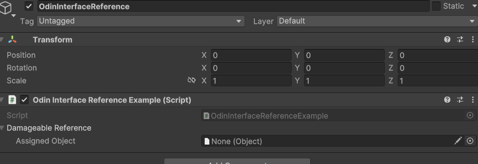

# InterfaceReference

## 目的

1. 编写设计一个自定义类型，用于存储继承了<u>**特定接口**</u>的对象引用
2. 重新设计 InterfaceReference 的抽屉绘制，使其能够拖拽对象选择
3. 设计 `[RequiredInterface()]` 属性，表示特殊类型才可以分配给该字段

## 准备

- Unity 6 LTS
- Odin 3.3.1.10

## 开始设计

### 自定义类设计 OdinInterfaceReference<TInterface，TObject>

1. 需要实现对象或者资产拖拽操作，说明肯定是引用类型存储为接口类型的字段，这样才可以方便操作分配到对应接口的对象

因此被分配的对象类型必须继承自 `UnityEngine.Object`

2. 需要一个接口类型的字段或者属性与外界进行交互

创建一个接口类型的属性 `Value`，设置 get ，set 验证机制，Value_get 必须让实际类型 `TObject` 实现指定接口`TInterface`，否则抛出异常，Value_Set 必须让 `value` 是 `TObject` 类型及其派生类，必须达到模式匹配的要求

3. 如果不特殊指定 `TObject` 类型，在 Unity 中可以衍化出一个简单泛型，直接使用 `UnityEngine.Object`类型，即 `public class InterfaceReference<TInterface> : InterfaceReference<TInterface, Object> where TInterface : class { }`

当前设计步骤完成截图：

如此设计，序列化 AssignedObject 字段，是不会经过 Get Set 的验证的，所以需要隐藏 AssignedObject 字段，自定义绘制一个对象引用，并进行验证操作，同时维持AssignedObject 字段的序列化

### 自定义设计 OdinInterfaceReference<TInterface，TObject> 的抽屉绘制，使其能够拖拽对象选择

## 视频疑问

- It is very nice that you were able to make such a concise and effective video and make it public, and I thank you very much. But I currently have some questions about whether the title is a little inappropriate, "Serialize Interface?" Since it appears to actually be a serialized reference to a field of type UnityEngine.Object, all we do is hide the original UnityEngine.Object reference selector, redraw a reference selector, and then perform interface validation through this reference selector. Only authenticated instances or assets can be assigned to the actually hidden UnityEngine.Object type field, This differs from the [SerializeReference] tag in that we can directly modify the actual type of the field in Inspector and refer to instance objects elsewhere. This should have a different meaning than what Odin refers to as Serialize Interfaces (I don't know exactly how Odin works), perhaps using "how to draw an interface reference selector" is a better expression, the key point is the reference selector. If I have made any mistakes, could you please point them out?
- 你能够制作如此简洁有效的视频并公开，这是非常nice的，我非常感谢您。但是我目前有一些疑问，这个标题是否有一点不合适，“Serialize Interface ？”，因为它似乎实际上是对 UnityEngine.Object 类型的字段的序列化引用，我们所做的工作只是把原本的 UnityEngine.Object 引用选择器隐藏起来，重新绘制一个引用选择器，然后通过这个引用选择器进行接口验证，只有通过验证的实例或资产才能赋值给实际隐藏的 UnityEngine.Object 类型字段 ，这样的做法与标记[SerializeReference]的不同之处在于我们可以在 Inspector 中直接修改字段实际类型以及引用其他地方的实例对象。这个与 Odin 所说的 Serialize Interfaces 应该是不同的含义（我不清楚Odin的具体原理），也许使用 “如何绘制一个接口引用选择器” 是一个更好的表述，关键点在于引用选择器。如果我有什么错误，能麻烦您指出一下吗？
